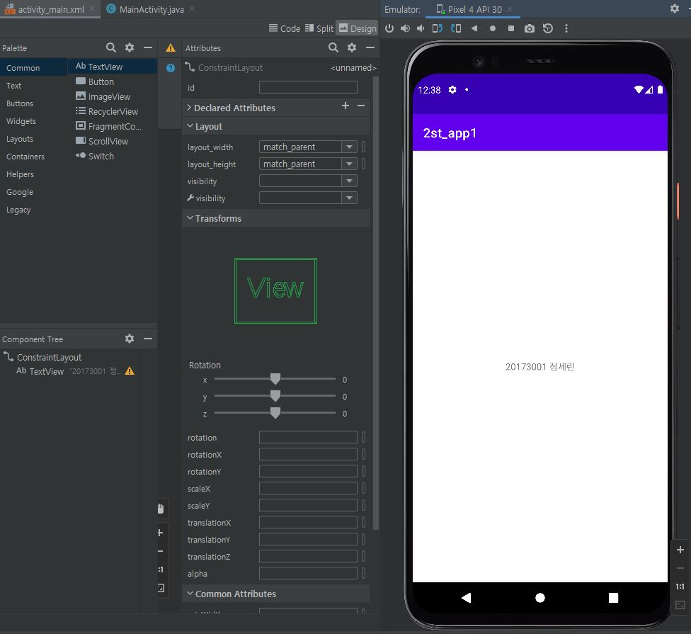

# 2주차(2022-3-15)
- 안드로이드 스튜디오 설치 & GITHUB 가입 및 레포지토리 만듦
- <lmg>

# 3주차(2022-03-22)
  -버튼 생성 및 네이버 버튼, 전화걸기 버튼 만듦 
-  -  - 
  
# 4주차(2022-03-29)
  -Toast Message 버튼 만들어 학번과 이름을 뜨게 함 & 버튼을 MainAtivity code에서 만듦
  
  -
  
# 5주차(2022-04-05)
- 버튼 크기 모양 바꾸기 & 이미지 바꾸기 버튼을 이용해서 사진 두장 바꾸기
  
  -
  
# 6주차(2022-4-12)  
  - 스크롤뷰 사용하기
  
   
